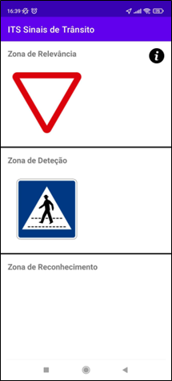
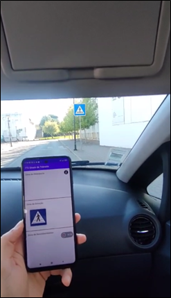

## Overview:

- This Android app, developed using Java in Android Studio, is designed for drivers to receive real-time information about upcoming traffic signs based on their current GPS location.

- The project was completed as part of my final university assignment, in collaboration with a partner. It is based on a desktop application initially developed in C# by university professors, which we analyzed and adapted into this mobile version.

## App Description:

- The app’s interface is divided into three distinct zones: the Awareness Zone, the Detection Zone, and the Relevance Zone. These zones display traffic signs depending on the driver's distance to them.

- When the app is first launched, it makes a request to an API to retrieve information about all the traffic signs in the driver's surrounding area, including their relevant details. Each traffic sign returned by the API is associated with specific zones and the segments that define those zones.

- The app then compares the driver’s GPS location with the GPS coordinates of the traffic signs' zone segments, determining which zone the driver is currently in. The corresponding traffic sign is displayed on the interface in its respective zone. This comparison is performed every second (only if the driver has moved at least 1 meter). As the driver continues along the route, traffic signs will appear and disappear from the app’s interface according to their proximity.

- After the driver has traveled a certain distance, the app makes another API request to refresh its traffic sign data, repeating the process.

## Technologies and Libraries Used:

- Code in Java

- Interface in XML

- Retrofit and OKHttp for API interactions and automatic JSON parsing

- Google Play Services Location for interactions and management of driver's location
  
## Exemplifying Images:

 

      

<i>App's interface with example traffic signs</i>

 

    

<i>Real world usage example</i>

